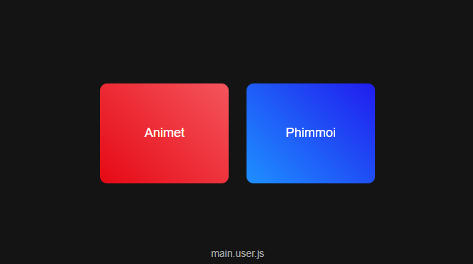

# Anytv-web

## Description
A script to make simple UI for any movie website.

## Table of Contents
- [Installation](#installation)
- [Usage](#usage)
- [Contributing](#contributing)

## Installation

### ・ Browser Extention

1. Install [UserScripts](https://github.com/quoid/userscripts?tab=readme-ov-file#installation)
2. Access script url at [here](https://hajaulee.github.io/anytv-web/main.uset.js)
3. Install script by UserScripts
4. Access Dashboard at [here](https://hajaulee.github.io/anytv-web)

### ・ Android APK

Download APK file from [here](https://github.com/hajaulee/AnyTV/raw/master/app/release/AnyTV-2.0.5-release.apk)

## Usage

Access Dashboard at [here](https://hajaulee.github.io/anytv-web)

## Contributing
Guidelines for contributing to the project.

1. Fork the repository.
2. Create a new branch.
3. Make your changes.
4. Submit a pull request.
